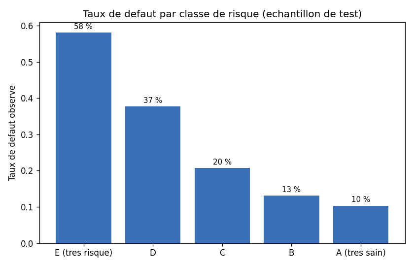
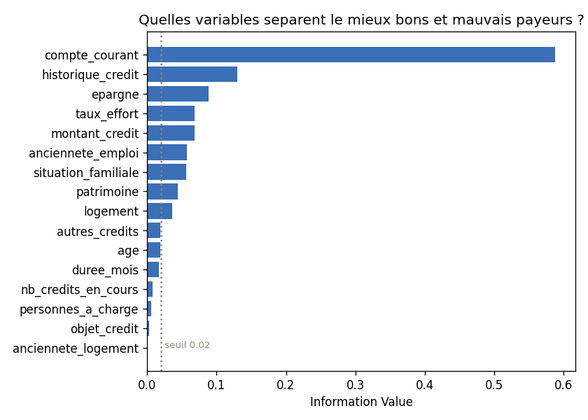
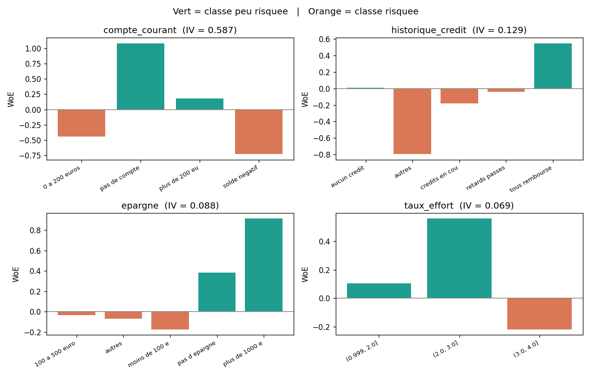
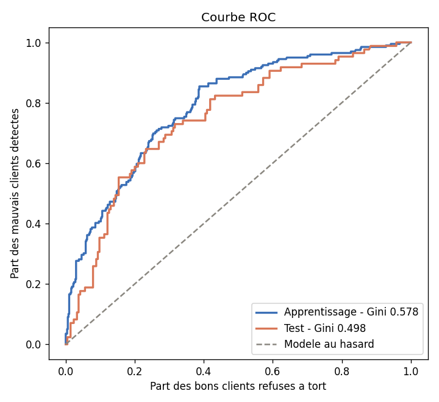

# Scoring de crédit — construction d'une grille de score

Projet de data science : prédire le risque de défaut de paiement sur 1000 demandes
de crédit, et transformer le modèle en **grille de score** lisible par un conseiller
bancaire.

C'est la méthode utilisée en banque : découpage en classes, Weight of Evidence,
régression logistique, puis conversion en points.

**Résultat : Gini de 0.50 sur l'échantillon de test.** Les 20 % de dossiers les
plus risqués affichent 58 % de défaut, contre 10 % pour les 20 % les plus sains.



---

## Lancer le projet

```bash
git clone https://github.com/VOTRE-PSEUDO/scoring-credit.git
cd scoring-credit
pip install -r requirements.txt
python scoring.py
```

Le script affiche chaque étape dans le terminal et écrit tous les résultats dans
`resultats/`.

---

## Contenu du dépôt

| Fichier | Rôle |
|---|---|
| `scoring.py` | **Le projet.** Un seul script, 8 étapes commentées |
| `generer_donnees.py` | Comment le jeu de données a été fabriqué |
| `data/credit.csv` | Les 1000 dossiers de crédit |
| `resultats/` | Grille de score, tableaux et graphiques produits |
| `requirements.txt` | Les 4 bibliothèques nécessaires |

---

## La méthode, étape par étape

### 1. Les données

1000 demandes de crédit, 16 variables (compte courant, épargne, historique de
remboursement, âge, montant, durée…) et une cible : `defaut` = 1 si le client n'a
pas remboursé. **28,4 % de défauts.**

On modélise toujours le défaut, jamais le bon client. Si on code l'inverse, tous
les signes s'inversent et la grille finit par récompenser le risque.

### 2. Apprentissage et test

70 % des dossiers pour construire le modèle, 30 % gardés de côté pour le juger.
Le découpage est *stratifié* : les deux groupes ont le même taux de défaut, sinon
les résultats ne sont pas comparables.

### 3. Découpage en classes

Chaque variable est transformée en 3 ou 4 classes :

- variables numériques (âge, montant…) → 4 tranches contenant chacune 25 % des clients ;
- variables texte (épargne, logement…) → les modalités rares (moins de 5 % des
  clients) sont regroupées dans « autres ».

Pourquoi ? Une classe de 3 clients ne veut rien dire, et le découpage rend le
modèle robuste aux valeurs extrêmes.

### 4. Weight of Evidence et Information Value

Pour chaque classe :

```
WoE = ln( % de bons clients dans la classe / % de mauvais clients dans la classe )
```

- WoE **positif** → classe moins risquée que la moyenne
- WoE **négatif** → classe plus risquée que la moyenne

Et pour chaque variable :

```
IV = somme sur les classes de ( % bons − % mauvais ) × WoE
```

L'IV mesure la capacité de la variable à séparer les bons des mauvais payeurs.

| IV | Lecture |
|---|---|
| < 0,02 | la variable ne sert à rien |
| 0,02 – 0,10 | faible |
| 0,10 – 0,30 | moyen |
| > 0,30 | fort |
| > 0,50 | vérifier qu'il n'y a pas de fuite de données |





Le passage par le WoE est ce qui rend la suite possible : le WoE est déjà une
log-odds, donc la relation avec le défaut devient linéaire — exactement ce que
suppose la régression logistique.

### 5. Sélection des variables

On garde les variables d'IV ≥ 0,02. Ici **10 variables sur 16**.

### 6. Régression logistique

Chaque variable est remplacée par son WoE, puis on entraîne le modèle.

**Le contrôle à faire absolument :** tous les coefficients doivent être négatifs.
Un WoE élevé signifie « client sain », il doit donc faire *baisser* le risque. Un
coefficient positif dirait « plus le profil est sain, plus il fait défaut » — c'est
un signal d'alerte, pas un résultat.

La régression logistique reste le standard en banque non par archaïsme, mais parce
qu'un refus de crédit doit pouvoir être motivé auprès du client.

### 7. La grille de score

On convertit le modèle en points :

```
facteur  = PDO / ln(2)
décalage = score_cible − facteur × ln(odds_cible)
points   = −(coefficient × WoE + constante / nb_variables) × facteur + décalage / nb_variables
```

Avec le paramétrage choisi (`score_cible = 600`, `odds_cible = 50`, `PDO = 20`) :
**600 points = 50 bons clients pour 1 mauvais**, et **+20 points = deux fois moins
de risque**.

Extrait de `resultats/grille_de_score.csv` :

| Variable | Classe | Taux de défaut | Points |
|---|---|---|---|
| compte_courant | solde négatif | 45 % | 35 |
| compte_courant | 0 à 200 euros | 38 % | 43 |
| compte_courant | plus de 200 euros | 24 % | 63 |
| compte_courant | pas de compte | 12 % | 90 |

Le modèle et la grille sont mathématiquement équivalents — mais l'un se lit et
l'autre non.

### 8. Performance

| | Apprentissage | Test |
|---|---|---|
| Gini | 0,578 | **0,498** |
| KS | 0,467 | **0,415** |
| AUC | 0,789 | **0,749** |

- **Gini** = 2 × AUC − 1. Entre 0,40 et 0,60, c'est un bon modèle de crédit.
- **KS** = écart maximum entre les bons et les mauvais clients cumulés. On attend
  plus de 0,30.

L'écart de Gini entre apprentissage et test est de 0,08, sous le seuil d'alerte de
0,10 : le modèle n'est pas en sur-apprentissage.



Classes de risque sur l'échantillon de test :

| Classe | Part du portefeuille | Taux de défaut | Décision |
|---|---|---|---|
| E (très risqué) | 20 % | 58 % | refus |
| D | 20 % | 38 % | refus |
| C | 20 % | 21 % | étude manuelle |
| B | 20 % | 13 % | accord |
| A (très sain) | 20 % | 10 % | accord |

---

## À propos des données

Les données sont **simulées**, à partir d'un modèle de risque connu, et imitent la
structure du jeu classique *German Credit* (UCI). `generer_donnees.py` montre
exactement comment elles ont été construites.

Ce choix est volontaire : il rend le projet reproductible sans téléchargement, et
permet de vérifier que le scoring retrouve bien les variables qui déterminent le
risque.

---

## Pour aller plus loin

- Comparer avec un **gradient boosting** (XGBoost, LightGBM) et expliquer les
  prédictions avec SHAP
- Imposer la **monotonie** du taux de défaut entre classes voisines
- Calculer le **PSI** pour suivre la dérive du modèle dans le temps
- Choisir le **seuil de décision** à partir des coûts métier (accepter un mauvais
  client coûte bien plus cher que refuser un bon)
- Traiter la question de l'**équité** : `situation_familiale` est utilisée ici,
  or certaines variables sont interdites par la loi dans une décision de crédit

---

## Licence

MIT
